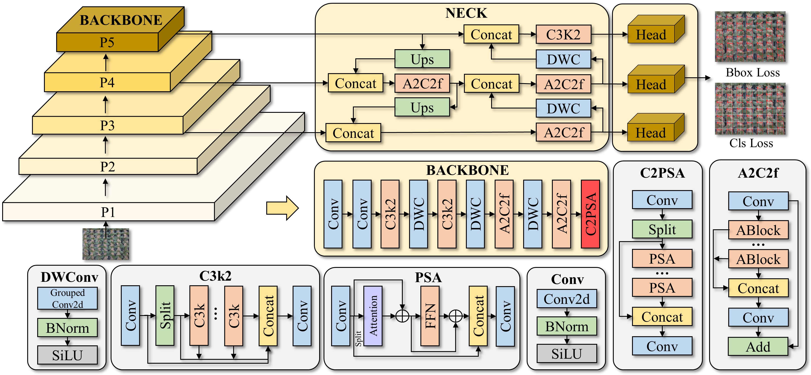
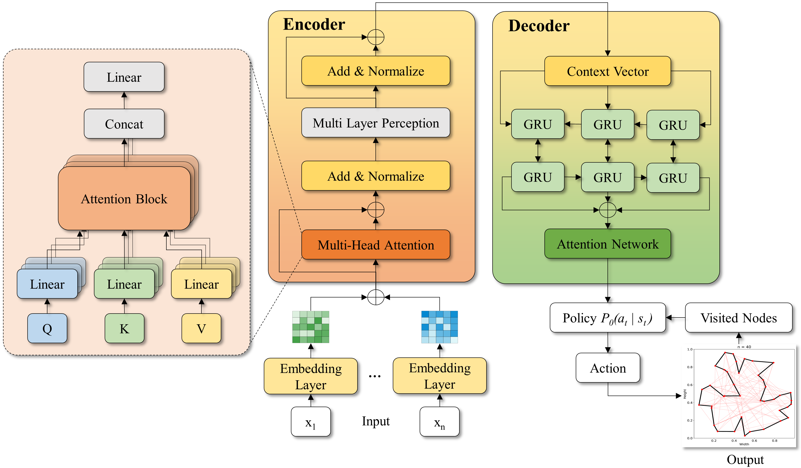

# OrchidBot

OrchidBot is a visual workflow for orchid leaf orientation analysis and robotic manipulation. The project combines computer vision, neural-network-based perception, path planning, data visualization, and robotic execution to support automated orchid leaf handling.

## Overview

The system is organized as a sequential pipeline:

1. Image-based orchid leaf observation
2. Leaf segmentation
3. Target detection and orientation estimation
4. Robotic path planning
5. Visualization and data analysis
6. Physical robotic execution

## Workflow

### 1. Overall System


This figure presents the complete OrchidBot workflow, showing how visual input, perception modules, planning components, and robotic execution are connected within the system.

### 2. Segmentation Network


The segmentation network identifies orchid leaf regions from input images. This stage separates the target leaf area from the background and provides structured visual information for later analysis.

### 3. Detection Network



The detection network localizes important leaf-related features and supports orientation estimation. The output of this stage is used to guide downstream robotic planning.

### 4. Path Planning Network



The path planning module converts perception results into a feasible robotic motion strategy. It links the detected leaf orientation with robot trajectory generation.

### 5. Visualization Data


This visualization summarizes experimental data and system outputs, making it easier to inspect model behavior, orientation results, and the relationship between perception and planning.

### 6. Robotic Execution


The robotic execution stage demonstrates how the planned motion is applied in a real robotic setup. This step validates the complete pipeline from image perception to physical action.

## Repository Structure

```text
.
|-- 1_overall_system.png
|-- 2_segmentation_network.png
|-- 3_detection_network.png
|-- 4_path_planning_network.png
|-- 5_visualization_data.png
|-- 6_robotic_execution.png
`-- README.md
```

## Notes

This repository currently focuses on visual documentation of the OrchidBot system architecture and workflow. Source code, datasets, model checkpoints, and experimental results can be added in future updates.

## Author

Maintained by [ductai243](https://github.com/ductai243).
