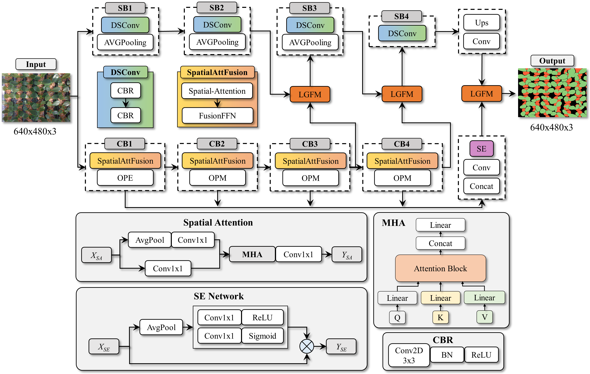
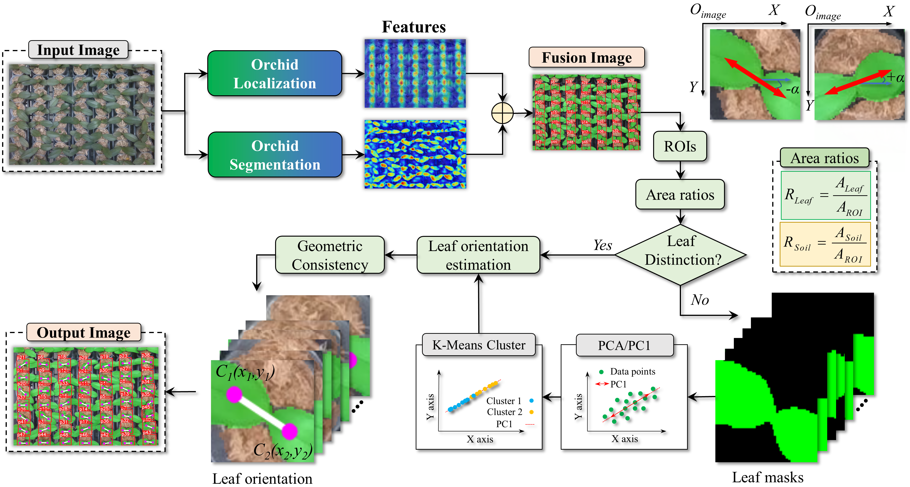

# Deep Visual Perception and Deep Reinforcement Learning-Based Path Optimization for Autonomous Phalaenopsis Orchid Management System Under Dense Foliage in Greenhouses


## Abstract

This work proposes a perception-planning framework for autonomous Phalaenopsis orchid management under dense foliage greenhouse conditions. The system integrates orchid orientation perception with robotic pot rotation sequence optimization to reduce manual labor and support balanced plant growth.

- A lightweight dual-path segmentation network extracts fine-grained orchid leaf structures from dense foliage scenes.
- A detection model localizes orchid pots under variable illumination and occlusion.
- Machine learning-based structural analysis estimates orchid leaf orientation from segmented regions.
- An encoder-decoder planning model trained with deep reinforcement learning optimizes rotation sequences and reduces redundant robotic movements.
- Orientation estimation achieved R2 values from 0.922 to 0.955, with MAE values of 2.6 to 3.4 degrees.
- The proposed planning model outperformed metaheuristic and learning-based baselines in both solution quality and computational efficiency.
- Real greenhouse validation achieved a 90.6% rotation success rate with an average execution time of 6.8 s per orchid.

## Keywords

Perception-planning framework; agricultural robotics; visual perception for agricultural robotics; deep reinforcement learning; orchid greenhouse.

## System Overview

The system is organized as a sequential pipeline:

1. Image acquisition under dense foliage greenhouse conditions
2. Fine-grained orchid leaf segmentation
3. Orchid pot detection and leaf orientation estimation
4. Deep reinforcement learning-based rotation sequence optimization
5. Visualization and quantitative evaluation
6. Physical robotic execution in a greenhouse environment

## Workflow

### 0. Proposed Framework


This figure provides a high-level view of the proposed autonomous Phalaenopsis orchid management framework under dense foliage greenhouse conditions.

### 1. Overall System


This figure presents the complete autonomous orchid management workflow, connecting visual perception, orientation estimation, rotation planning, and robotic execution.

### 2. Segmentation Network



The lightweight dual-path segmentation network extracts fine-grained orchid leaf structures from dense foliage scenes. This stage provides the structural leaf information required for reliable orientation estimation.

### 3. Detection Network


The detection model localizes orchid pots under dense foliage and variable illumination. These detection results are integrated with segmented leaf structures to support plant-level orientation analysis.

### 4. Rotation Sequence Planning


The encoder-decoder-based planning model is trained using deep reinforcement learning to optimize the pot rotation sequence. The goal is to reduce redundant robot movements while preserving high computational efficiency.

### 5. Orientation Estimation Module



This module estimates orchid leaf orientation from segmented structural regions and supports plant-level rotation decision-making.

### 6. Robotic Execution


The robotic execution stage validates the proposed framework in a real greenhouse environment. The system achieves autonomous orchid pot rotation based on the optimized manipulation sequence.

## Key Results

- Orientation estimation achieved R2 values from 0.922 to 0.955.
- Mean absolute error ranged from 2.6 to 3.4 degrees.
- The proposed planning model outperformed metaheuristic and learning-based baselines in solution quality and efficiency.
- Real greenhouse deployment achieved a 90.6% rotation success rate.
- Average robotic execution time was 6.8 s per orchid.

## Repository Structure

```text
.
|-- resource/
|   |-- 0_overal_system.png
|   |-- 1_overall_system.png
|   |-- 2_segmentation_network.png
|   |-- 3_detection_network.png
|   |-- 4_path_planning_network.png
|   |-- 5_orientation_estimation_module.png
|   `-- 6_robotic_execution.png
`-- README.md
```

## Author

Maintained by [ductai243](https://github.com/ductai243).
